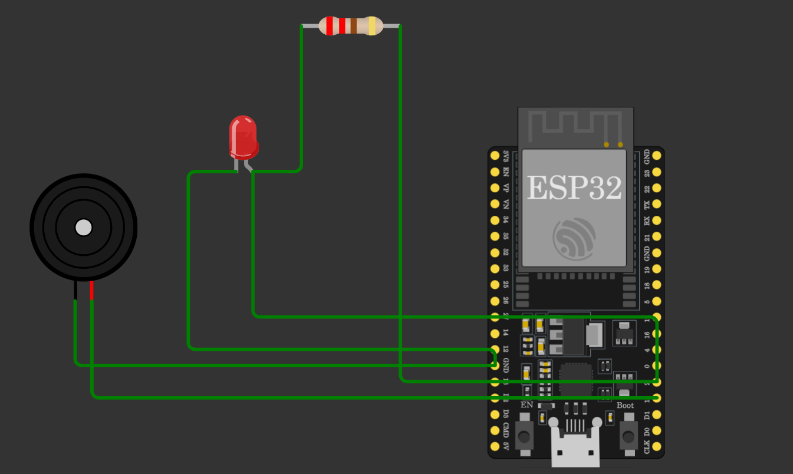
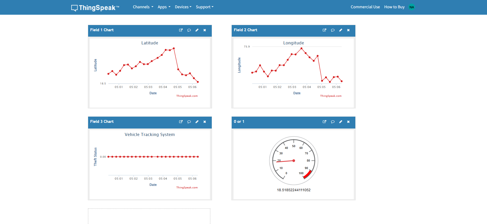

# 🚗 IoT Vehicle Tracking & Theft Prevention System

An IoT-based simulation project that tracks vehicle location using GPS logic and detects theft using geofencing. The system visualizes real-time data using ThingSpeak cloud dashboard and a Python-based simulation engine.

---

## 📌 Project Overview

This project simulates a real-world vehicle tracking and anti-theft system used in:
- Logistics companies 🚚  
- Ride-sharing apps (Uber/Ola style) 🚖  
- School buses 🚌  
- Personal vehicle security systems 🔐  

It detects vehicle movement, monitors location, and triggers an alert when the vehicle moves outside a safe geofence area.

---

## ⚙️ Features

✔ Real-time GPS simulation  
✔ Theft detection using geofencing logic  
✔ Buzzer alarm system  
✔ LED status indicator  
✔ Cloud data visualization using ThingSpeak  
✔ Graphs for Latitude & Longitude  
✔ Gauge for vehicle status  
✔ Python-based data generator (simulation mode)

---

## 🧠 System Workflow

GPS Simulation → ESP32 / Python → Geofence Logic → ThingSpeak Cloud → Dashboard (Graphs + Gauge)

---

## 🧰 Tech Stack

- Python 🐍  
- ESP32 (Wokwi Simulation)  
- ThingSpeak Cloud ☁  
- Arduino IDE / Wokwi  
- Git & GitHub  

---

## 📦 Project Structure

IoT-Vehicle-Tracking-System/
│
├── arduino_code/
├── python_backend/
├── flask_dashboard/
├── circuit_diagram/
├── screenshots/
├── requirements.txt
└── README.md

---

## 🚀 How to Run

### 1️⃣ Install dependencies
pip install requests

### 2️⃣ Run simulation script
python python_backend/simulator.py

### 3️⃣ Run ThingSpeak sender (if used)
python python_backend/thingspeak_sender.py

---

## 📊 ThingSpeak Dashboard

https://thingspeak.mathworks.com/channels/3407500

Fields:
- Field 1 → Latitude  
- Field 2 → Longitude  
- Field 3 → Theft Status (0/1)  
- Field 4 → Vehicle Status (Gauge)

Widgets:
- Line Chart (Latitude)
- Line Chart (Longitude)
- Gauge (Vehicle Status)

---

## 🔌 Circuit Components

- ESP32 Dev Board  
- LED (Status Indicator)  
- Buzzer (Alarm System)  
- GPS Module (optional in real system)  

---

## 📸 Project Output

### 🔌 Circuit Simulation (Wokwi)

### 📊 ThingSpeak Live Dashboard

---

## 🚨 Working Principle

1. Vehicle location is simulated using Python  
2. Data is sent to ThingSpeak using API  
3. Geofence logic detects unauthorized movement  
4. Buzzer activates on theft detection  
5. Dashboard visualizes real-time movement  

---

## 📈 Future Improvements

- Live GPS hardware integration  
- Mobile app tracking system  
- SMS/Email alerts  
- Google Maps live tracking  
- AI-based theft prediction  

---

## 👨‍💻 Author
Nidhi Apotikar
IoT Student Project  
Vehicle Tracking & Theft Prevention System  

